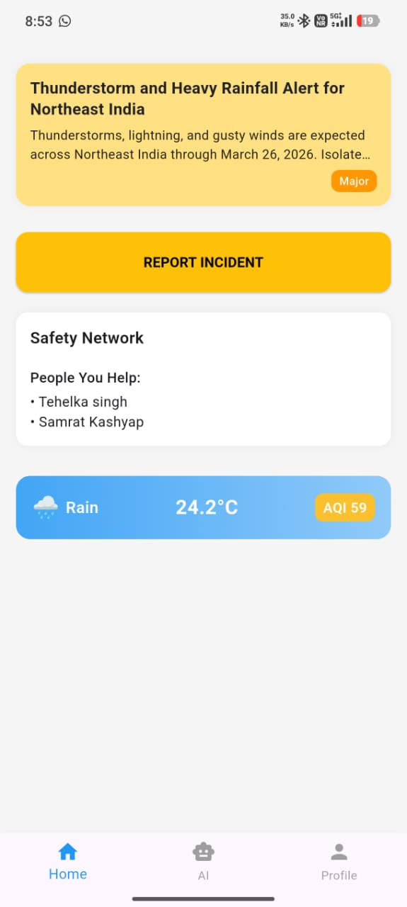
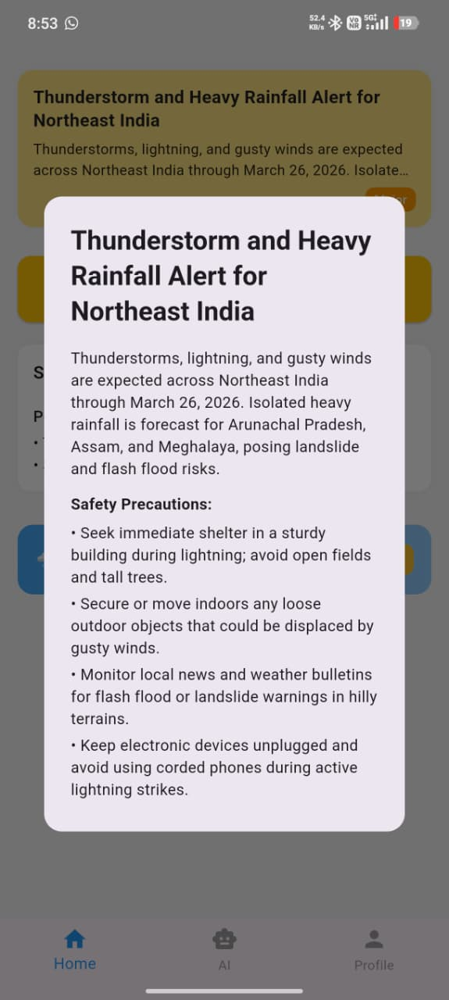
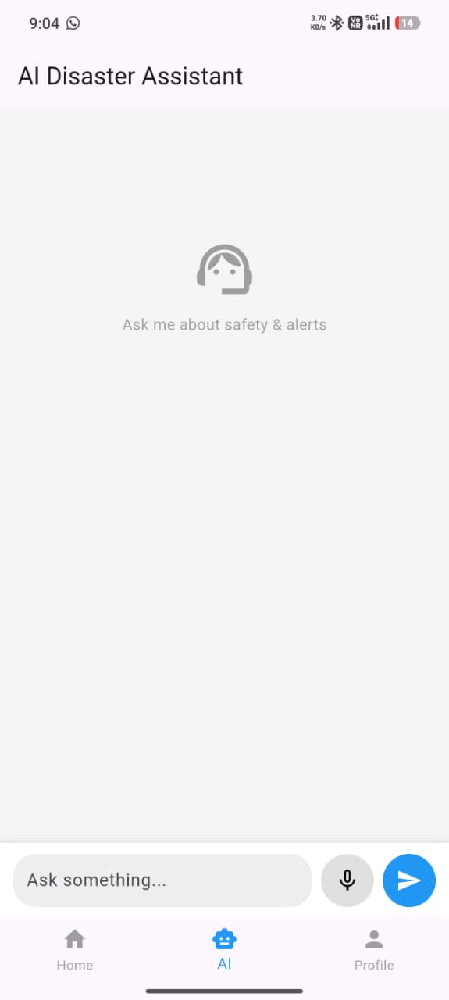
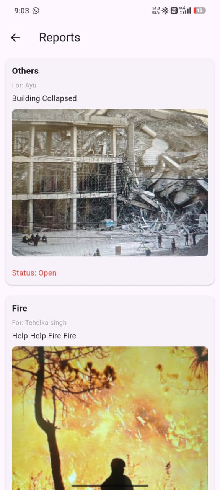
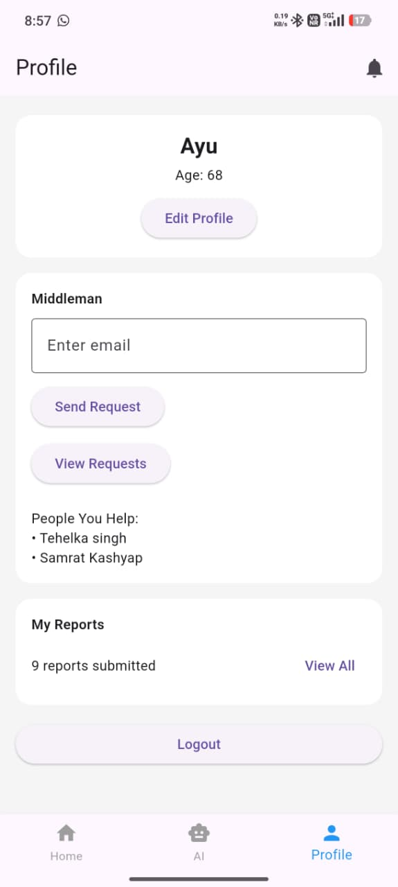

# 🌍 AapdaSetu – AI-Powered Disaster Response Platform

> Intelligent disaster preparedness, emergency reporting, and real-time citizen assistance powered by AI.

<p align="center">


</p>

---

# 📱 Overview

**AapdaSetu** is an AI-powered disaster response mobile application designed to help citizens stay informed, report emergencies, and receive real-time safety guidance during disasters.

The application integrates **location-aware emergency alerts**, an **AI disaster assistant**, **multimedia incident reporting**, **live weather & AQI**, and an **offline-first architecture** to improve disaster preparedness and response.

---

# ✨ Key Highlights

- 🚨 Real-time location-based disaster alerts
- 🤖 AI-powered disaster guidance
- 📍 Automatic location detection
- 🌤 Live Weather & Air Quality Index (AQI)
- 📸 Image & Audio incident reporting
- 🎤 Voice-to-Text assisted reporting
- 👥 Safety Network for trusted contacts
- 📦 Offline-first architecture using Hive
- 🔐 Secure authentication using Supabase

---

# 🚀 Features

## 🚨 Smart Emergency Alerts

- Location-aware disaster alerts
- Severity-based alert cards
- Detailed safety precautions
- Pull-to-refresh support

---

## 🤖 AI Disaster Assistant

- AI-powered emergency guidance
- Context-aware conversations
- Voice input support
- Conversation history

---

## 📝 Incident Reporting

Users can report disasters with:

- 📸 Images
- 🎤 Audio recordings
- 🗣 Voice-to-text description
- 📍 GPS Location
- 🏷 Disaster Category
- 📝 Manual description

---

## 🌤 Weather & Air Quality

- Current weather
- Temperature
- Air Quality Index
- Automatic location updates

---

## 👥 Safety Network

- Trusted middlemen
- Linked citizens
- Emergency coordination

---

## 📦 Offline Support

- Hive local storage
- Automatic synchronization
- Works during unstable connectivity

---

# 🛠 Tech Stack

| Category | Technology |
|----------|------------|
| Framework | Flutter |
| Language | Dart |
| Backend | Supabase |
| Database | PostgreSQL |
| Authentication | Supabase Auth |
| Storage | Supabase Storage |
| Local Database | Hive |
| AI | Gemini AI (Supabase Edge Functions) |
| Weather | Open-Meteo API |
| Air Quality | Open-Meteo AQI API |
| Location | Geolocator |
| Speech | Speech-to-Text |
| Audio | Record |
| Image Upload | Image Picker |

---

# 🏗 System Architecture

```text
                Citizen
                   │
                   ▼
        Flutter Mobile App
                   │
     ┌─────────────┼─────────────┐
     ▼             ▼             ▼
 Supabase      Open-Meteo     Device APIs
 Database        APIs      Camera • GPS • Mic
     │
     ▼
 Supabase Edge Functions
     │
     ▼
 Gemini AI
```

---

# 📷 Screenshots

## Authentication

| Login |
|-------|
|  |

---

## Home Dashboard

| Home |
|------|
|  |

---

## Emergency Alerts

| Alerts |
|--------|
|  |

---

## AI Disaster Assistant

| AI Chatbot |
|------------|
|  |

---

## Incident Reporting

| My Reports |
|------------|
|  |

---

## Profile & Safety Network

| Profile |
|----------|
|  |

---

# 📂 Project Structure

```
lib/
 ├── navigation/
 ├── screens/
 ├── services/
 ├── widgets/
 ├── models/
 └── main.dart

assets/
 ├── images/
 └── screenshots/
```

---

# 🚀 Getting Started

Clone the repository

```bash
git clone https://github.com/Ayush-620/AapdaSetu-Mobile.git
```

Install dependencies

```bash
flutter pub get
```

Run the application

```bash
flutter run
```

Build release APK

```bash
flutter build apk --release
```

---


# 👨‍💻 Developer

**Ayush Kashyap**

B.Tech Computer Science & Engineering (AI & Data Science)

IIIT Senapati, Manipur

GitHub: https://github.com/Ayush-620

---

# ⭐ Support

If you found this project useful,

Please consider giving it a ⭐ on GitHub.